# 📘 Serverless Media Processing Pipeline (AWS) — GUI Lab Documentation

------

# 🧩 PART 1 — S3 BUCKET SETUP

## 🔹 1.1 Create Raw Upload Bucket

1. Go to Amazon S3 → **Buckets**
2. Click **Create bucket**
3. Configure:
   - **Bucket name:** `raw-uploads-<unique>`
   - **Region:** ap-south-1 (Mumbai)
4. Enable:
   - ✅ Versioning
   - ✅ Default encryption → SSE-S3
5. Click **Create bucket**

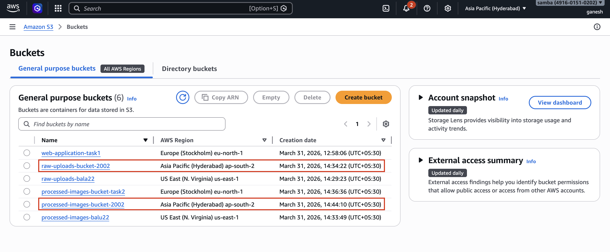

------

## 🔹 1.2 Configure CORS

1. Open bucket → **Permissions tab**
2. Edit **CORS configuration**
3. Add:

```
[
  {
    "AllowedHeaders": ["*"],
    "AllowedMethods": ["PUT", "GET"],
    "AllowedOrigins": ["*"]
  }
]
```

1. Save changes

------

## 🔹 1.3 Create Processed Images Bucket

1. Click **Create bucket**

2. Configure:

   - **Bucket name:** `processed-images-<unique>`
   - **Region:** ap-south-1

3. Enable:

   - ✅ Versioning
   - ✅ Encryption → SSE-KMS (`aws/s3`)

4. Click **Create bucket**

   

   

------

# 🔁 PART 2 — CROSS-REGION REPLICATION (CRR)

## 🔹 2.1 Create Destination Bucket

⚠️ Must be created manually

1. Create bucket:
   - Name: `raw-uploads-replica-<unique>`
   - Region: eu-west-1 (Ireland)
2. Enable:
   - ✅ Versioning
3. Create bucket

------

## 🔹 2.2 Configure Replication Rule

1. Open **raw-uploads bucket**
2. Go to **Management → Replication → Create rule**
3. Configure:
   - Rule name: `replicate-all`
   - Scope: **All objects**
4. Destination:
   - Choose **existing bucket**
   - Select replica bucket
5. IAM Role:
   - Select **Create new role**
6. Save rule

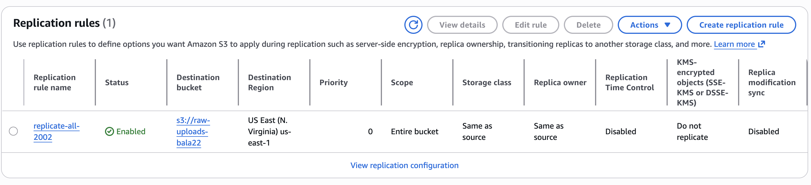
------

# 🕒 PART 3 — LIFECYCLE POLICY

## 🔹 3.1 Create Lifecycle Rule

1. Open raw bucket → **Management**
2. Click **Lifecycle rules → Create rule**
3. Configure:
   - Name: `archive-rule`
   - Apply to: All objects
4. Transitions:
   - After 30 days → Standard-IA
   - After 365 days → Glacier
5. Save rule


------

# ⚙️ PART 4 — LAMBDA IMAGE PROCESSOR

## 🔹 4.1 Create Lambda Function

1. Go to AWS Lambda
2. Click **Create function**
3. Configure:
   - Name: `image-processor`
   - Runtime: Python 3.11

------

## 🔹 4.2 Configure Resources

- Memory: **512 MB**
- Timeout: **30 seconds**

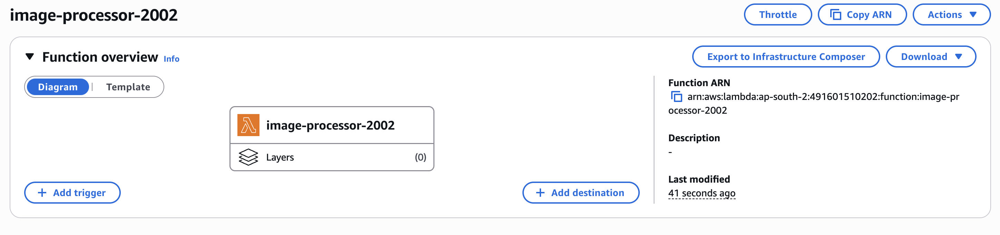

------

## 🔹 4.3 Add S3 Trigger

- Source: S3
- Bucket: raw-uploads
- Event: ObjectCreated (PUT)

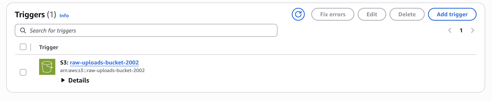

------

## 🔹 4.4 Add Pillow Layer

- Add external layer for image processing

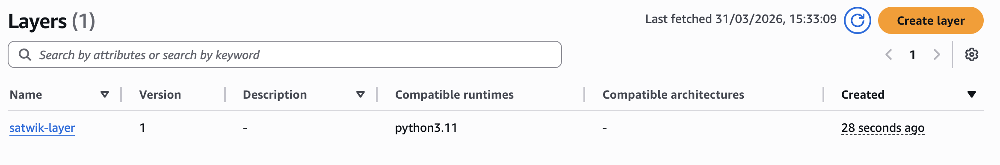
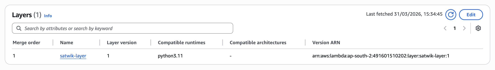
------

## 🔹 4.5 Lambda Code

```
import boto3
from PIL import Image, ImageDraw
import io

s3 = boto3.client('s3')
DEST_BUCKET = 'processed-images-<name>'

def lambda_handler(event, context):
    for record in event['Records']:
        bucket = record['s3']['bucket']['name']
        key = record['s3']['object']['key']

        file = s3.get_object(Bucket=bucket, Key=key)
        img = Image.open(io.BytesIO(file['Body'].read()))

        img = img.resize((800, 600))

        draw = ImageDraw.Draw(img)
        draw.text((10,10), "Watermark", fill=(255,255,255))

        buffer = io.BytesIO()
        img.save(buffer, "JPEG")
        buffer.seek(0)

        s3.put_object(
            Bucket=DEST_BUCKET,
            Key=f"processed/{key}",
            Body=buffer
        )
```

Click **Deploy**

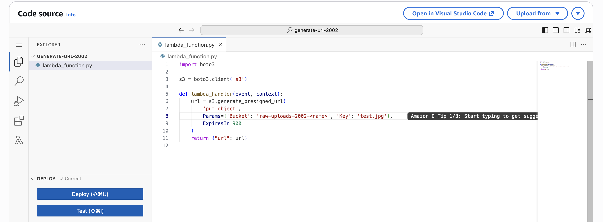

------

# 📬 PART 5 — DEAD LETTER QUEUE (SQS)

## 🔹 5.1 Create Queue

1. Go to Amazon SQS
2. Click **Create queue**
3. Name: `lambda-dlq`

------

## 🔹 5.2 Attach to Lambda

- Lambda → Configuration → Destinations
- Add:
  - On failure → SQS queue

------

# 🔗 PART 6 — PRE-SIGNED URL GENERATION

## 🔹 6.1 Create Lambda

- Name: `generate-url`
- Runtime: Python 3.11

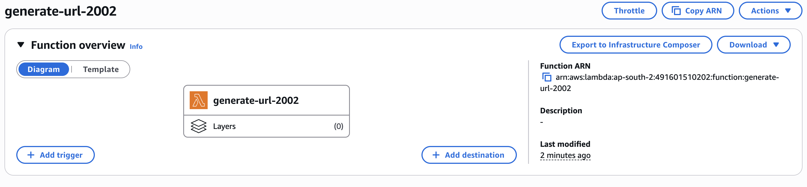

------

## 🔹 6.2 Code

```
import boto3

s3 = boto3.client('s3', region_name='ap-south-1')

def lambda_handler(event, context):
    url = s3.generate_presigned_url(
        'put_object',
        Params={
            'Bucket': 'raw-uploads-<name>',
            'Key': 'test.jpg'
        },
        ExpiresIn=900
    )
    return {"url": url}
    
```

------

# 🌍 PART 7 — CLOUDFRONT + LAMBDA@EDGE

## 🔹 7.1 Create Distribution

1. Go to Amazon CloudFront
2. Click **Create distribution**
3. Origin:
   - Select processed-images bucket
4. Viewer policy:
   - Redirect HTTP → HTTPS
5. Create distribution

------

## 🔹 7.2 Lambda@Edge Setup

1. Switch region → **us-east-1**
2. Create Lambda

------

## 🔹 7.3 Code

```
def lambda_handler(event, context):
    response = event['Records'][0]['cf']['response']
    headers = response['headers']

    headers['x-frame-options'] = [{
        'key': 'X-Frame-Options',
        'value': 'DENY'
    }]

    return response
```

------

## 🔹 7.4 Attach to CloudFront

- Deploy to Lambda@Edge
- Event: Viewer Response
- Attach to distribution

------

# 🧪 PART 8 — TESTING & VALIDATION

## 🔹 8.1 Generate Upload URL

- Invoke Lambda → copy URL

------

## 🔹 8.2 Upload Image

```
curl -X PUT -T image.jpg "<URL>"
```

------

## 🔹 8.3 Validate Processing

Check:

- Raw bucket → original image exists
- Processed bucket → resized image exists

------

## 🔹 8.4 Validate Replication

- Check Ireland bucket → replicated file


------

## 🔹 8.5 Access via CDN

```
https://<cloudfront-url>/processed/test.jpg
```

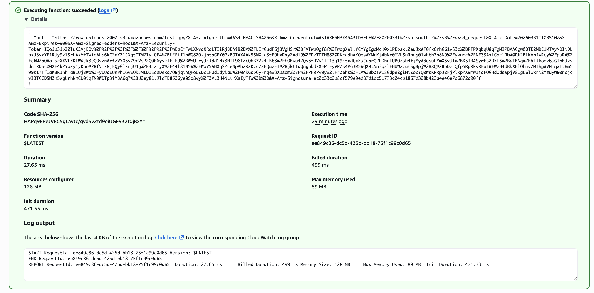

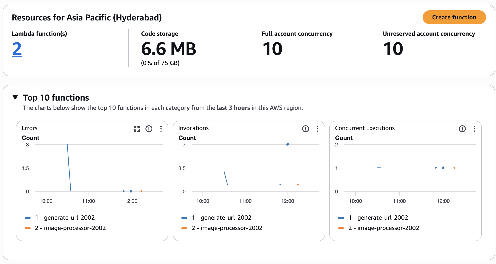
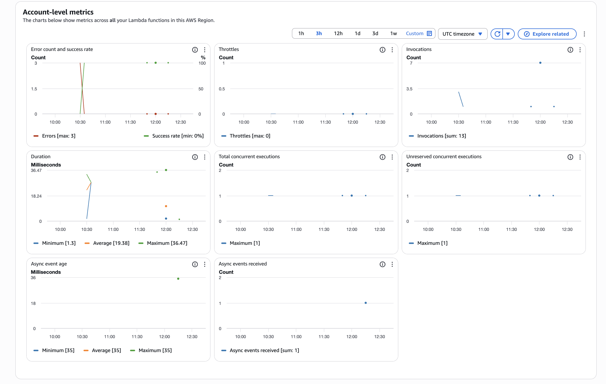
